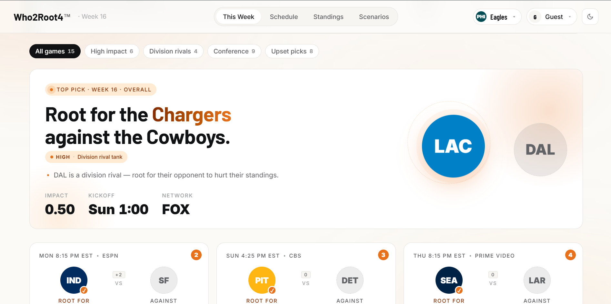

# Who2Root4

**Tell it your team. It tells you who to root for.**

Who2Root4 pulls live NFL data from the ESPN public API, builds a semantic RDF knowledge graph using the [holonic](https://pypi.org/project/holonic/) four-graph model, applies official NFL tiebreaker logic, and outputs a ranked list of games you should care about this week — and which team to cheer for in each.

---

---

## Install

```bash
pip install -r requirements.txt
```

---

## Quick Start

```bash
# Current week — Steelers fan
python pipeline.py --team PIT

# Full season with playoff scenario analysis
python pipeline.py --team PIT --full-season

# Full season through a specific week
python pipeline.py --team PIT --full-season --through-week 14 --season 2025

# Include postseason rounds (Wild Card → Super Bowl)
python pipeline.py --team PIT --full-season --postseason

# Simulate standings as of week 12 (blanks results for weeks ≥ 12)
python pipeline.py --team PIT --full-season --sim-week 12

# Dislikes also affect recommendation scores
python pipeline.py --team PIT --dislikes BAL CLE

# Save graph to TriG, also dump per-named-graph Turtle files
python pipeline.py --team PIT --full-season --output holarchy.trig --dump-graphs

# Dry-run: load from saved ESPN JSON (no network)
python pipeline.py --team PIT --json-file espn_data.json

# Force re-fetch even if cache exists
python pipeline.py --team PIT --full-season --force-refresh
```

---

## Tiebreaker CLI

```bash
# Resolve a division tie
python tiebreaker.py --conference AFC --division North

# Resolve wild card bubble
python tiebreaker.py --wildcard AFC
```

---

## File Layout

```text
Who2Root4/
├── pipeline.py                          # Orchestration entry point
├── tiebreaker.py                        # Standalone NFL tiebreaker CLI
├── requirements.txt
│
├── ontology/                            # OWL 2 / RDF vocabularies
│   ├── core.ttl
│   ├── competition.ttl
│   └── playoff_impact_recommendation.ttl
│
├── builders/
│   ├── espn_fetcher.py                  # ESPN API → normalised Python dicts
│   ├── rdf_builder.py                   # Dicts → holonic rdflib Dataset
│   ├── season_ingester.py               # Multi-week ingestion with disk cache
│   ├── scenario_builder.py              # Clinch / elimination scenario holons
│   ├── recommendation_engine.py         # Graph reasoning → rooting recommendations
│   ├── team_strength.py                 # Multi-signal team strength scoring
│   └── membrane_validator.py            # SHACL / boundary validation
│
├── queries/
│   └── sparql_queries.py                # Named SPARQL queries + run_query() helper
│
└── tests/
```

---

## How It Works

### 1 — Ingest
`espn_fetcher.py` pulls scoreboard and standings from the ESPN public API. In `--full-season` mode, `season_ingester.py` fetches all weeks (with a local JSON cache) and can simulate any mid-season state with `--sim-week`.

### 2 — Build the Graph
`rdf_builder.py` turns the normalised Python dicts into a holonic RDF `Dataset` with named graphs:

| Named Graph IRI                     | Layer      | Contents                                  |
|-------------------------------------|------------|--------------------------------------------|
| `urn:nfl:graph:team:<ABBR>`         | Interior   | Per-team facts (name, record, division)    |
| `urn:nfl:graph:games:<season>:<wk>` | Interior   | Game events for a specific week            |
| `urn:nfl:graph:outcomes`            | Interior   | Completed game outcomes + impact edges     |
| `urn:nfl:graph:competition`         | Interior   | Structural & competitive edges             |
| `urn:nfl:graph:standings`           | Interior   | Standings snapshot + playoff assignments   |
| `urn:nfl:graph:scenarios`           | Interior   | Active clinch / elimination scenario holons|
| `urn:nfl:graph:tiebreakers`         | Interior   | Tiebreaker order + reasons                 |
| `urn:nfl:graph:holarchy`            | Context    | Registry of all holons + their graph IRIs  |
| `urn:nfl:graph:recommendations`     | Projection | User-specific rooting recommendations      |
| (default graph)                     | Boundary   | Ontology / SHACL shapes                    |

### 3 — Tiebreakers
`tiebreaker.py` implements the full official NFL division and wild-card tiebreaker procedure (head-to-head, division record, common games, conference record, strength of victory/schedule, combined ranking, net points, net touchdowns). Results are written into `graph:tiebreakers` as `nfl:tiebreakOver` / `nfl:tiebreakReason` triples.

### 4 — Scenarios
`scenario_builder.py` generates clinch and elimination scenario holons — concrete sets of results that would seal a playoff spot or knock a team out — and links them to the relevant impact edges.

### 5 — Recommendations
`recommendation_engine.py` queries the graph with SPARQL and scores every upcoming game on several signals (divisional urgency, active scenario requirements, disliked teams, standings proximity, team strength). The highest-scoring game is the one you should care about most, and the recommended team is the side whose win helps your team the most.

---

## Example Output

```
================================================================
  ROOTING GUIDE for Pittsburgh Steelers fans
================================================================

  #1  Root for: Cincinnati Bengals         vs  Baltimore Ravens
      Score:    0.782  [################    ]
      Why:      BAL is a division rival still in the title race (1.0 GB, 5 weeks left) — their loss directly helps; BAL losing satisfies an active clinch scenario requirement (score 0.78)

  #2  Root for: Jacksonville Jaguars       vs  Houston Texans
      Score:    0.621  [############        ]
      Why:      HOU is a conference competitor — their loss improves wild card odds (score 0.62)
```

---

## Extending

### Swap in Apache Jena Fuseki

```python
from holonic.backends.fuseki_backend import FusekiBackend
from holonic import HolonicDataset

ds = HolonicDataset(backend=FusekiBackend("http://localhost:3030", dataset="nfl"))
```

Pass `ds.dataset` to `NFLGraphBuilder`.

### Add User Preferences Directly

```python
from builders.rdf_builder import USER, NFL, _team_iri

user_g = builder.dataset.graph("urn:nfl:graph:users")
user_g.add((USER["josh"], NFL.favoriteTeam, _team_iri("PIT")))
user_g.add((USER["josh"], NFL.dislikes,     _team_iri("BAL")))
```
